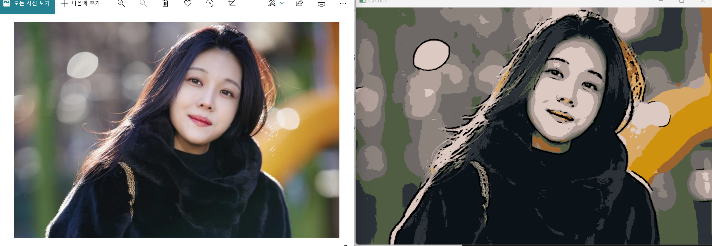
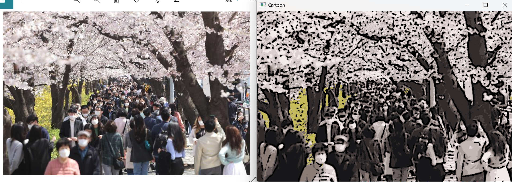

# photoon
Turn your photo into a cartoon!

# 개요
실사 이미지를 카툰풍의 그림으로 바꾸어주는 소프트웨어입니다.

# 원리
1. median blur를 이용해 이미지의 노이즈를 제거.
2. 이미지의 윤곽선을 추출
3. k-means 클러스터링을 이용하여 이미지의 색상 quantization. 
4. 이미지의 윤곽선과 채색 부분 합성

# 잘 된 예시

# 잘 안 된 예시

# 한계
위의 두 예시에서 볼 수 있듯이 이미지의 색을 양자화 하는 과정에서 버려지는 색이 있을 수 있습니다.
이 문제를 해결하기 위해서는 k 값을 정하는 알고리즘을 추가해야 합니다.
또한 윤곽선의 추출이 완벽하지 않기 때문에 윤곽선이 짧은 점선으로 표시되어 어색한 그림이 나타나기도 합니다.

